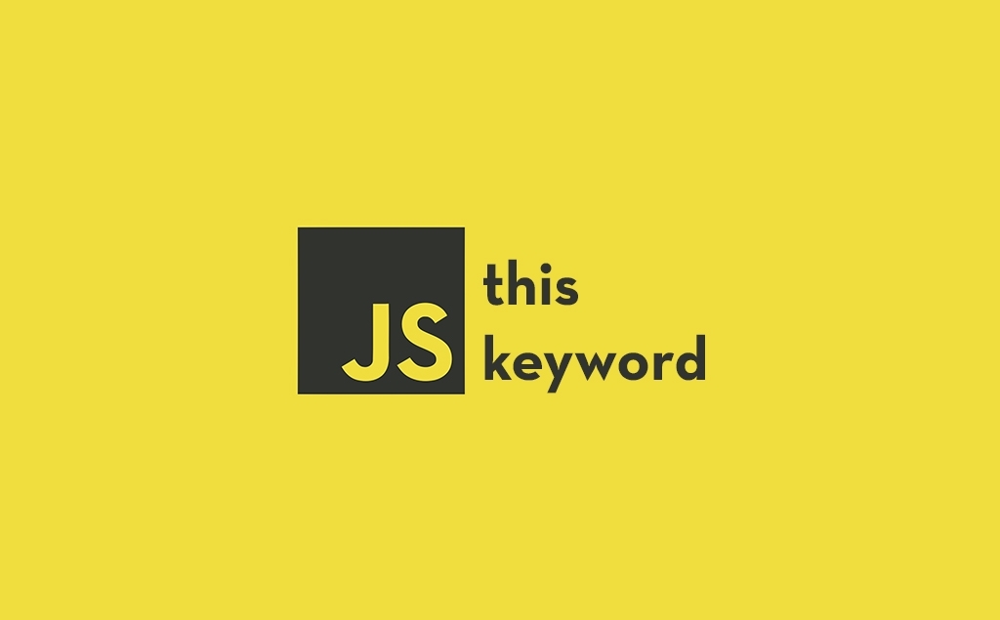

# How to Master This Keyword in Javascript

## Table of Contents

| No. | Topics                                    |
| --- | ----------------------------------------- |
| 1   | [About Code Courses](#about-code-courses) |
| 2   | [Course Content](#live-demo)              |

## 1. About Code Courses

[Code Courses](https://codecourses.site) is a website where people learn about coding and different technologies/frameworks/libraries. For the purpose of helping people learn, all of the courses are **FREE** and **DETAIL**. Following that, they will be written in detail. For this reason, Code Courses believe that you do not need to buy any courses out there. Hopefully, after following the content on Code Courses, you will find your dream jobs, and build any applications that you want.

## 2. Introduction

For the full course, You can refer to this [link](https://codecourses.site/javascript/how-to-master-this-keyword-in-javascript/).

In this course/tutorial, we will talk about the 'this' keyword in the Javascript programming language. This course/tutorial helps us master this keyword in Javascript. Mastering this keyword can help us crack many interviews and save a lot of time while coding. There are some common mistakes when using this keyword that we should notice.

- Context.
- Callback.
- Closure.
- Assign 'this' function to a variable.
- Borrowing method.
